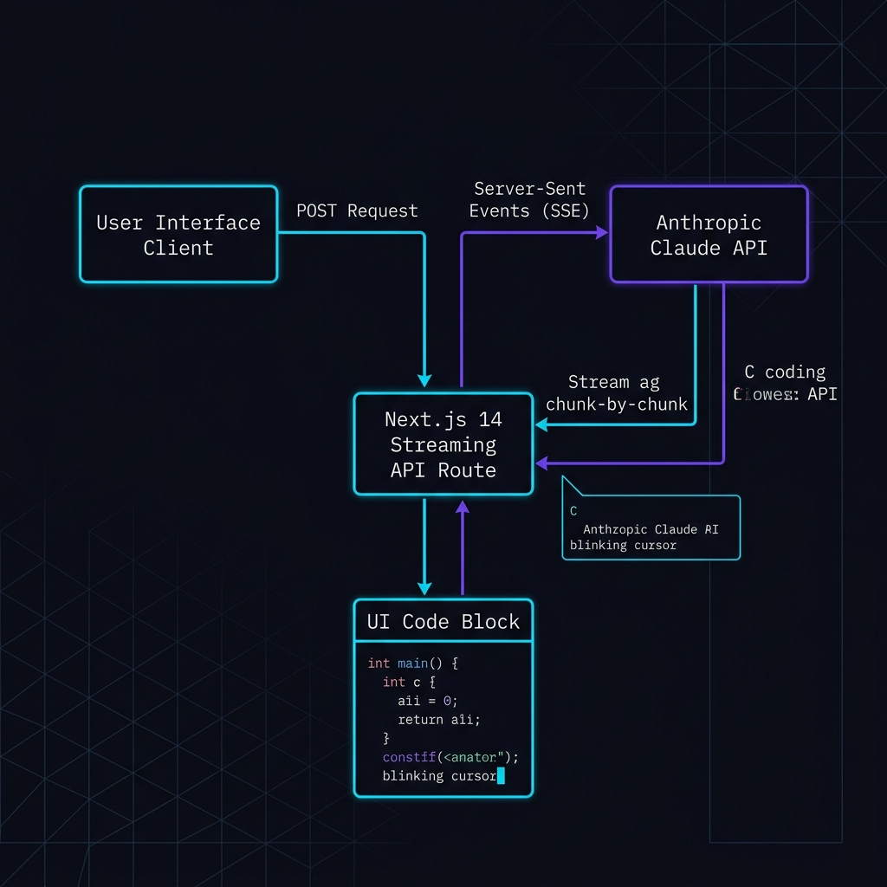

# FirmForge

FirmForge is an enterprise-grade firmware and RTOS (Real-Time Operating System) code generation engine specifically designed for electrical, computer, and embedded systems engineering professionals. By leveraging specialized prompt engineering and the Claude API, FirmForge provides rapid, context-aware scaffolding of hardware initialization routines, driver snippets, and multi-threaded RTOS task architectures. 

The application is styled using an Industrial Precision theme—a near-black dark aesthetic with grid alignments, monospace labels, and custom oscilloscopic color codes. It is built to ensure correct register configurations, appropriate hardware abstraction layer (HAL) definitions, and structural conformity across a wide array of microcontroller platforms.

---

## System Architecture and Data Flow

FirmForge is designed with a decoupled client-server architecture. The user interface handles state management, dynamic configuration form rendering, and real-time streaming consumption, while the server performs prompt synthesis, validation, and handles secure communication with the Anthropic API.

Below is the detailed data flow mapping of the code generation pipeline:



### Data Flow Execution Steps:
1. **Configuration Input**: The user configures parameters for the target microcontroller unit (MCU), peripheral peripheral types, code style (e.g., HAL vs. Bare Metal), and specific peripheral-dependent fields (e.g., baud rate, clock speed, pins).
2. **HTTP POST Request**: Clicking the generation action constructs an HTTP POST request targeting the `/api/generate-snippet` endpoint, transmitting a JSON payload containing the user's selections.
3. **Endpoint Validation and Prompt Synthesis**: The Next.js API route validates the payload structure and verifies the availability of the server-side Anthropic API key. It then maps the configuration key-values into structured text parameters, combining them with a system-level engineering prompt.
4. **SSE-based Anthropic Claude API Call**: The backend initiates a POST request to the Anthropic Messages API (`claude-sonnet-4-20250514`) with streaming enabled.
5. **SSE Parsing and Stream Processing**: The API route receives Server-Sent Events (SSE) from Anthropic, decodes the chunks, parses the text delta contents, and constructs a chunked raw `text/plain` ReadableStream.
6. **Client-side Rendering**: The user interface reads the incoming stream chunk-by-chunk via the browser's streams API, progressively appending the code to the state. The CodeBlock component updates in real time, showing a blinking cursor effect while active.

---

## Key Features

### Dynamic Snippet Generator
- **Context-Aware Parameters**: The system automatically adapts its input fields based on the selected peripheral. Each peripheral loads a strict schema containing designated data types (text, selections) and default values.
- **Real-Time Code Streaming**: Code is rendered in a terminal-like environment line-by-line as the LLM streams the output, bypassing traditional blocking HTTP waiting states.
- **Syntax Highlighting and Control**: Custom-built styling elements apply coloring to C syntax structure, and copy-to-clipboard and single-click downloading of files (.c format) are supported natively.

### RTOS Architect
- **Natural Language Parsing**: Allows engineers to describe firmware behaviors, system requirements, and task flows in plain English.
- **Multi-File Workspace Scaffold**: Generates a unified RTOS implementation spanning:
  - `main.c`: Initializes peripherals, handles task queue/mutex registration, and starts the scheduler.
  - `tasks.h`: Declares function prototypes and lists task-specific definitions.
  - `config.h`: Centralizes thresholds, task priorities, queue dimensions, stack allocations, and pin configurations.
- **Customizable Architectural Toggles**: Options to include task scheduling block diagrams, system header files, and deep register-level inline comments.

---

## Microcontroller and Peripheral Support Matrix

The table below outlines peripheral compatibility across various supported microcontrollers within the FirmForge system.

| Microcontroller Unit | UART | SPI | I2C | ADC | DAC | GPIO | Timer/PWM | Interrupt | DMA | Watchdog |
|----------------------|------|-----|-----|-----|-----|------|-----------|-----------|-----|----------|
| STM32F103            | Yes  | Yes | Yes | Yes | Yes | Yes  | Yes       | Yes       | Yes | Yes      |
| STM32F4xx            | Yes  | Yes | Yes | Yes | Yes | Yes  | Yes       | Yes       | Yes | Yes      |
| STM32H7xx            | Yes  | Yes | Yes | Yes | Yes | Yes  | Yes       | Yes       | Yes | Yes      |
| ESP32                | Yes  | Yes | Yes | Yes | Yes | Yes  | Yes       | Yes       | Yes | Yes      |
| ESP8266              | Yes  | Yes | Yes | Yes | No  | Yes  | Yes       | Yes       | No  | Yes      |
| Arduino UNO          | Yes  | Yes | Yes | Yes | No  | Yes  | Yes       | Yes       | No  | Yes      |
| Arduino Mega         | Yes  | Yes | Yes | Yes | No  | Yes  | Yes       | Yes       | No  | Yes      |
| RP2040               | Yes  | Yes | Yes | Yes | No  | Yes  | Yes       | Yes       | Yes | Yes      |
| nRF52840             | Yes  | Yes | Yes | Yes | No  | Yes  | Yes       | Yes       | Yes | Yes      |

---

## Technical Stack

The system is constructed with modern, high-performance web standards to support responsive streaming interactions:

- **Framework**: Next.js 16.2.6 (utilizing App Router paradigms)
- **Runtime Environment**: React 19.2.4
- **Language**: TypeScript 5.0 (Strict mode compilation)
- **Styling Engine**: Tailwind CSS 4.0
- **Component Foundations**: `@base-ui/react` (v1.5.0) integrated via custom Shadcn UI mappings (v4.9.0)
- **Animation Framework**: Framer Motion 12.40.0
- **Typography Engine**: Syne (headings), DM Sans (body), and JetBrains Mono (monospaced code and labels) via Next.js Font Optimization
- **AI Core**: Anthropic Claude API (`claude-sonnet-4-20250514` model)

---

## API Reference

### POST /api/generate-snippet

Initiates a code-generation session based on the specified parameters, returning a chunk-by-chunk stream.

#### Request Headers
```http
Content-Type: application/json
```

#### Request Payload Schema (JSON)
```json
{
  "mcu": "string",
  "peripheral": "string",
  "codeStyle": "string",
  "parameters": {
    "key": "string"
  }
}
```

*Fields Description:*
- `mcu`: Microcontroller identifier (e.g., `"STM32F4xx"`, `"ESP32"`, `"Arduino UNO (ATmega328P)"`).
- `peripheral`: Target peripheral interface (e.g., `"UART"`, `"SPI"`, `"I2C"`, `"DMA"`).
- `codeStyle`: Library style configuration (e.g., `"HAL Library"`, `"Bare Metal (Registers)"`, `"Arduino IDE"`).
- `parameters`: Key-value map representing peripheral configuration configurations.

#### Request Example
```json
{
  "mcu": "STM32F4xx",
  "peripheral": "UART",
  "codeStyle": "HAL Library",
  "parameters": {
    "baudRate": "115200",
    "txPin": "PA9",
    "rxPin": "PA10",
    "dataBits": "8",
    "stopBits": "1",
    "parity": "None"
  }
}
```

#### Response Formats

##### Success (200 OK)
- **Content-Type**: `text/plain; charset=utf-8`
- **Cache-Control**: `no-cache`
- **Transfer-Encoding**: `chunked`
- **Body**: Streams the raw, comment-annotated C code.

##### Error Responses
- **400 Bad Request**: Missing request payload fields.
  ```json
  { "error": "Missing required fields: mcu, peripheral, codeStyle, parameters" }
  ```
- **500 Internal Server Error**: API Key misconfiguration or server crash.
  ```json
  { "error": "ANTHROPIC_API_KEY is not configured. Add it to .env.local" }
  ```
- **502 Bad Gateway**: Remote upstream connection issues with the Anthropic API.
  ```json
  { "error": "Anthropic API error: 503" }
  ```

---

## Project Structure

```
src/
├── app/
│   ├── layout.tsx            # App-wide layout wrapper, font provisioning, shell elements
│   ├── page.tsx              # Landing homepage containing product copy and hero elements
│   ├── api/
│   │   └── generate-snippet/
│   │       └── route.ts      # Serverless route executing Claude streaming integration
│   ├── generate/
│   │   └── page.tsx          # Main interaction route housing tabs for Generator and Architect
│   └── docs/
│       └── page.tsx          # Documentation view detailing MCU peripheral compatibility matrix
├── components/
│   ├── navbar.tsx            # Main shell navigational navbar with backdrop filter styling
│   ├── footer.tsx            # Structured footer with technical descriptors
│   ├── code-block.tsx        # Highlighted code displays, custom clipboard copying, and cursor pulses
│   ├── mcu-badge.tsx         # Graphic chip rendering displaying standard MCU layouts
│   ├── snippet-generator.tsx # Component orchestrating parameters panel and streaming response state
│   ├── rtos-architect.tsx    # Workspace workspace containing prompt architecture forms
│   └── ui/                   # Modular base-ui components configured for Shadcn
├── lib/
│   ├── constants.ts          # Static lists, selection variables, and fallback boilerplate configurations
│   ├── types.ts              # System-wide static type safety interfaces
│   ├── peripheral-params.ts  # Validation limits and field requirements mapped per peripheral
│   └── utils.ts              # Core utility methods (Tailwind merges, custom class helpers)
```

---

## Design System Specifications

FirmForge uses a dark engineering theme designed to replicate high-precision instrumentation dashboards:

- **Background (Base)**: `#0A0A0F` (near-black, blue-tinted)
- **Surface (Card/Dialog)**: `#12121A` (medium dark surface)
- **Border/Line**: `#1E1E2E` (deep grey border accent)
- **Primary Accent**: `#00D4FF` (oscilloscope neon cyan)
- **Secondary Accent**: `#7C3AED` (neon purple)
- **Indicator/Success**: `#00FF88` (digital green)
- **Text (Active)**: `#E8E8F0` (high contrast white-grey)
- **Text (Muted)**: `#6B6B8A` (low-contrast description grey)

---

## Setup and Installation

### Prerequisites
- **Node.js**: Version 20.x or higher
- **npm**: Version 10.x or higher

### Step-by-Step Installation

1. **Clone the Repository** and navigate to the project directory:
   ```bash
   cd vibe-coding-hackathon-2026-indias-largest-ai-web3-event-hackindia-noname
   ```

2. **Install Dependencies**:
   ```bash
   npm install
   ```

3. **Configure Environment Variables**:
   Create a `.env.local` file by copying the example file:
   ```bash
   cp .env.example .env.local
   ```
   Open `.env.local` and configure your API key:
   ```env
   ANTHROPIC_API_KEY=your_anthropic_api_key_here
   ```

4. **Launch Local Development Server**:
   ```bash
   npm run dev
   ```
   The application will become accessible at [http://localhost:3000](http://localhost:3000).

5. **Build and Start Production Server**:
   ```bash
   npm run build
   npm run start
   ```

---

## Deployment

FirmForge is structured for optimal hosting on Vercel:

1. Link your GitHub/GitLab repository to your [Vercel Dashboard](https://vercel.com).
2. Add your `ANTHROPIC_API_KEY` to the project's Environment Variables settings page on Vercel.
3. Deploy. The framework automatically detects Next.js configurations.

Alternatively, execute deployment workflows directly from the command line:
```bash
npx vercel --prod
```

---

## HackIndia 2026

Developed for **HackIndia 2026**—India's largest AI and Web3 Hackathon.

- **Team**: No_Name

---

## License

This project is licensed under the MIT License. Refer to the [LICENSE](./LICENSE) file for the full text.
